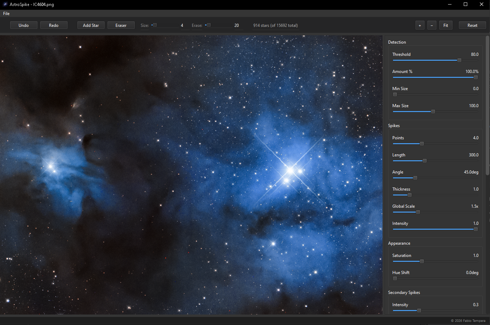

# AstroSpike



AstroSpike is a high-performance astronomical image processing application designed for manipulating and enhancing celestial imagery. The software focuses on the precise management of diffraction spikes and provides robust support for standard astronomical data format.

## Core Features

- Support for FITS and TIFF image formats.
- Cross-platform support for Windows and macOS.
- Intuitive Qt-based graphical user interface.

## Project Structure

The project follows a modular C++ architecture:

- `src/`: Main source code directory.
  - `core/`: Fundamental logic and statistical algorithms.
  - `io/`: Input/Output handlers for FITS and TIFF files.
  - `dialogs/`: UI components and dialog definitions.
- `deps/`: Third-party dependencies and libraries.
- `build/`: Target directory for compilation artifacts.

## Prerequisites

The `deps/` directory is not included in the repository. You must download and extract the following libraries into the `deps/` folder (or install them in your system) before building:

- **Qt6** (6.2+): Download from [Qt Official Website](https://www.qt.io/download). Ensure Widgets, Gui, Core, Concurrent, Xml, and Network modules are installed.
- **OpenCV** (4.x): Download from [OpenCV Releases](https://opencv.org/releases/). Extract to `deps/opencv`.
- **CFITSIO**: Download from [HEASARC](https://heasarc.gsfc.nasa.gov/fitsio/). Extract to `deps/cfitsio`.
- **CMake** (3.16+): Available at [cmake.org](https://cmake.org/download/).

### Required Folder Structure for Windows
To ensure the build scripts work correctly, organize your `deps` folder as follows:
```text
AstroSpike/
├── deps/
│   ├── opencv/
│   └── cfitsio/
└── src/
```

## Build Instructions

### Windows (MinGW)

The project includes a `build_all.bat` script to automate the Windows build process.

1. Ensure Qt6, OpenCV, and CFITSIO are installed and accessible in the system path or located in the `deps` directory.
2. Open a command prompt with the appropriate compiler environment (e.g., MinGW-w64).
3. Execute the build script:
   ```cmd
   build_all.bat
   ```
4. The executable will be generated in the `build` directory.

### macOS (Homebrew)

The build system leverages Homebrew for dependency management on macOS.

1. Install required packages:
   ```bash
   brew install qt opencv cfitsio libomp
   ```
2. Configure and build using CMake:
   ```bash
   mkdir build && cd build
   cmake ..
   make
   ```
3. Alternatively, use the provided shell scripts in `src/` for packaging.

## Installation

On Windows, an Inno Setup script (`installer.iss`) is provided to generate a standalone installer. Use the `build_installer.bat` script to automate this process.

## License

This project is licensed under the terms specified in the `LICENSE` file.
